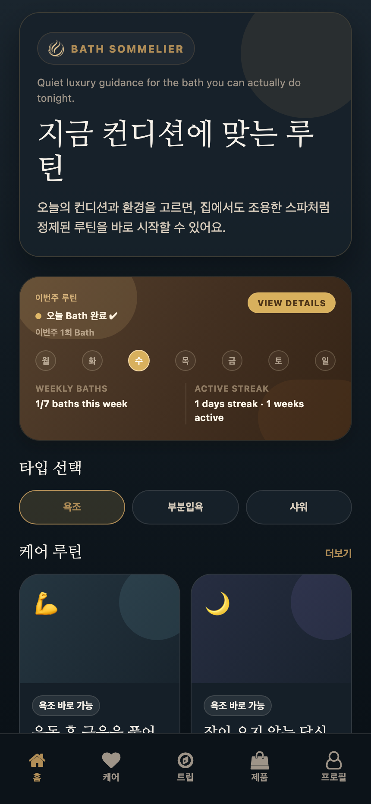
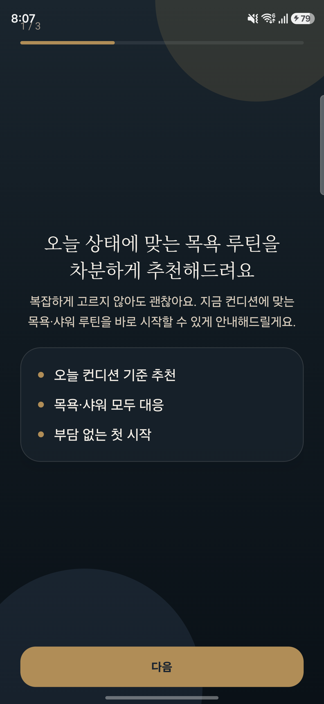
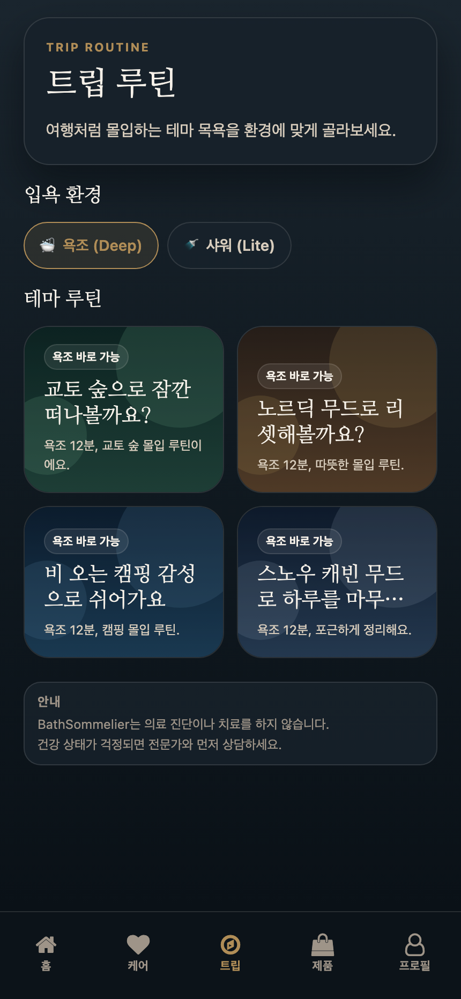
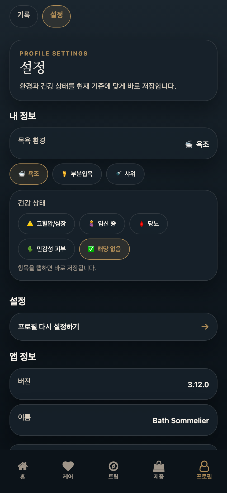
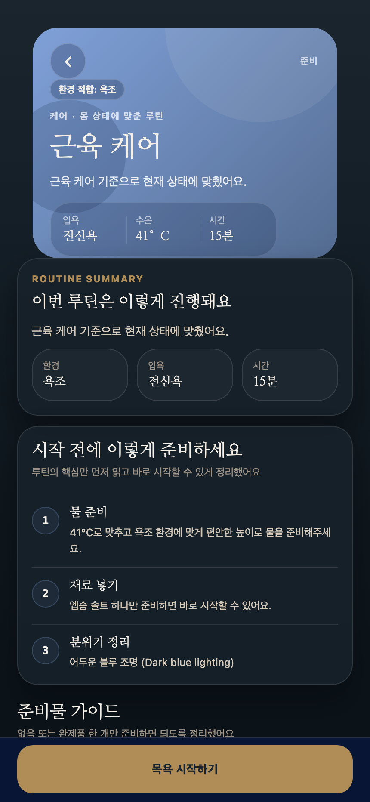
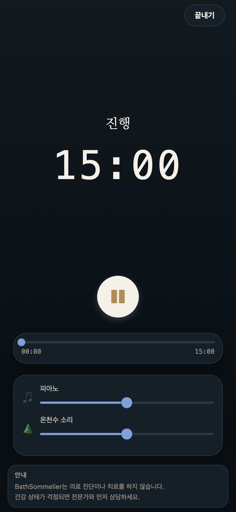
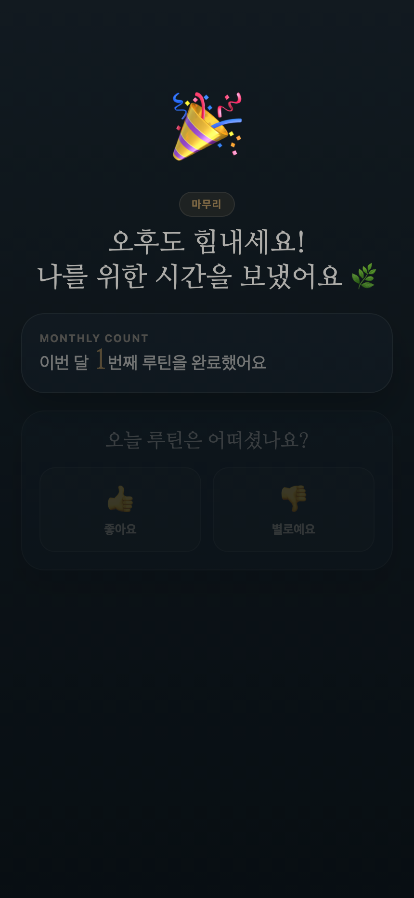

# 바스타임

바스타임은 오늘 상태와 목욕 환경에 맞춰 무리 없이 따라할 목욕·샤워 루틴을 안내하는 생활형 셀프케어 앱입니다. 컨디션 루틴과 무드 루틴을 보여주고, 레시피 확인부터 타이머, 완료 피드백, 기록 축적까지 한 흐름으로 연결합니다.

<p align="center">
  
</p>

## Overview

- 온보딩에서 `욕조`, `부분입욕`, `샤워` 환경과 건강 상태를 저장합니다.
- 홈에서 주간 바스타임 기록, 최근 루틴, 컨디션/무드 추천을 함께 확인할 수 있습니다.
- 컨디션 탭은 몸 상태 중심 루틴, 무드 탭은 분위기와 테마 중심 루틴을 제공합니다.
- 제품 탭에서 입문자가 바로 쓰기 쉬운 입욕제, 샤워 아이템, 바디워시를 안내합니다.
- 레시피, 타이머, 완료 피드백, 프로필/기록까지 로컬에 이어지는 루틴 플로우를 갖고 있습니다.
- 안전 가이드와 환경 제약을 추천 전반에 반영합니다.

## Current Flow

1. 온보딩에서 목욕 환경과 건강 상태를 설정합니다.
2. 홈 또는 케어/트립 탭에서 오늘 루틴을 고릅니다.
3. 레시피 화면에서 준비물, 온도, 시간, 안전 안내를 확인합니다.
4. 타이머 화면에서 루틴을 진행하고 완료 피드백을 남깁니다.
5. 프로필 탭에서 기록과 설정, 법적 문서를 확인합니다.

## App Screenshots

### Main Tabs

<p align="center">
  
  
  
</p>

<p align="center">
  
  
  
</p>

### Routine Flow

<p align="center">
  
  
  
</p>

## Tech Stack

- Expo SDK 54
- React Native 0.81
- Expo Router
- TypeScript
- AsyncStorage
- Jest

## Local Development

```bash
npm install
npm run web
```

```bash
npm test
npm run typecheck
```

## Refreshing Screenshots

README에 사용하는 최신 UI 캡처는 `output/screenshots/ui-states`에 저장됩니다.

```bash
npm run screenshots:ui
```

스크립트 실행 전에는 로컬 웹 서버가 떠 있어야 합니다. 기본 기준 주소는 `http://localhost:8082`이며, 다른 포트를 쓰면 `SCREENSHOT_BASE_URL` 환경변수로 바꿔서 실행할 수 있습니다.
