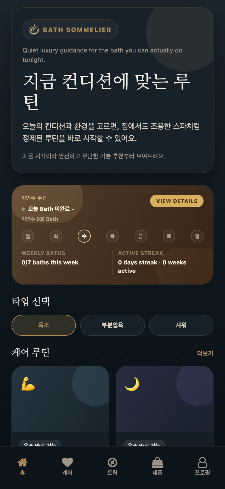
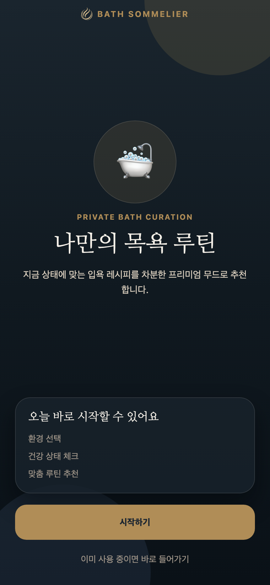
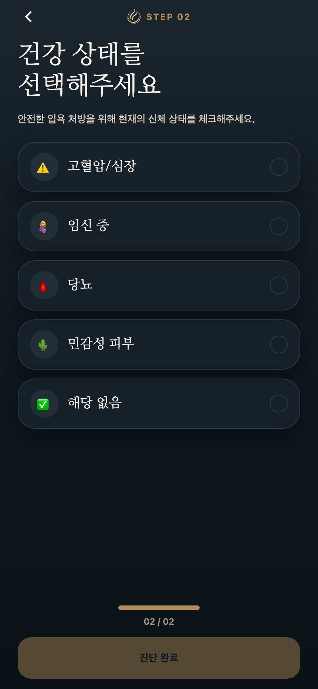
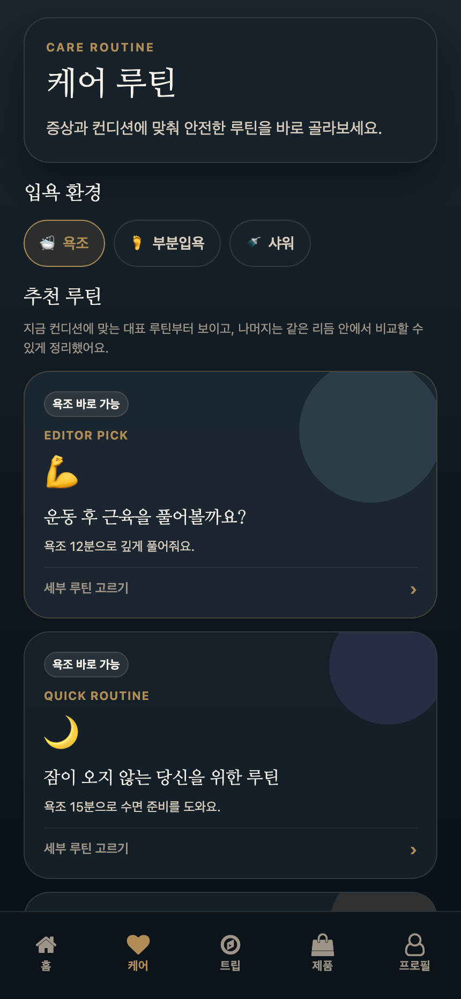
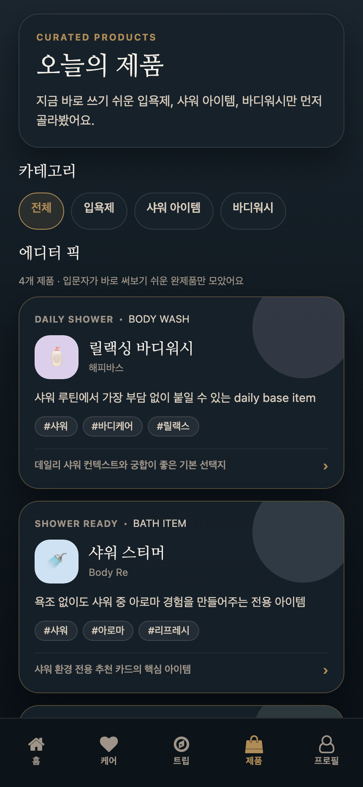

# 배쓰타임

배쓰타임은 사용자의 오늘 컨디션과 목욕 환경을 바탕으로, 더 잘 쉴 수 있는 목욕·샤워 루틴을 추천해주는 프리미엄 웰니스 앱입니다.

  

## Overview

- 짧은 입력만으로 오늘 상태에 맞는 목욕·샤워 루틴 추천
- 추천 이유, 진행 방법, 안전 안내를 함께 제공하는 설명형 경험
- 준비, 진행, 마무리, 회고까지 이어지는 배쓰타임 플로우
- 전문적으로 설계됐지만 부담 없이 따라갈 수 있는 조용한 프리미엄 톤

## App Screenshots

아래 이미지는 실행 중인 Expo 웹 앱에서 캡처한 실제 화면입니다.

  
  
  

  
  
  

## Tech Stack

- Expo
- React Native
- Expo Router
- TypeScript
- Jest

## Project Goal

이 프로젝트의 핵심은 한 문장으로 정리됩니다.

> 오늘 상태에 맞춰 더 잘 쉬는 목욕·샤워 루틴을 설계해준다.
